# Getting Started
1. Create a new Android Studio project.
    
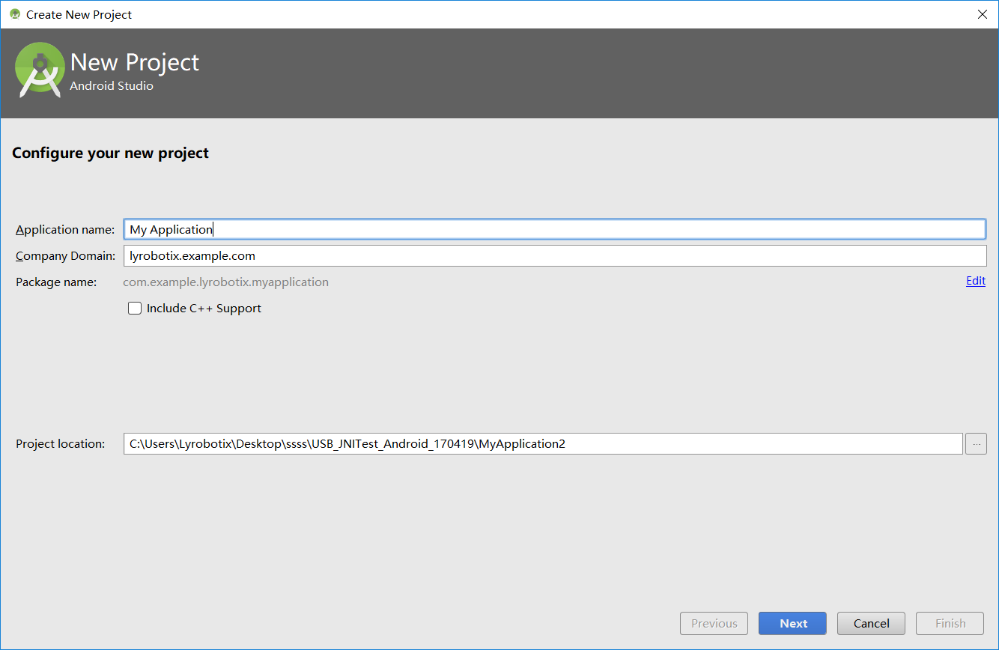
 
    
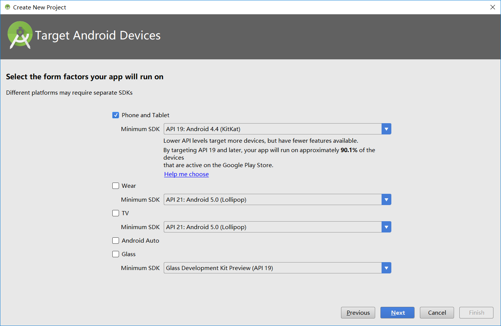
 
    
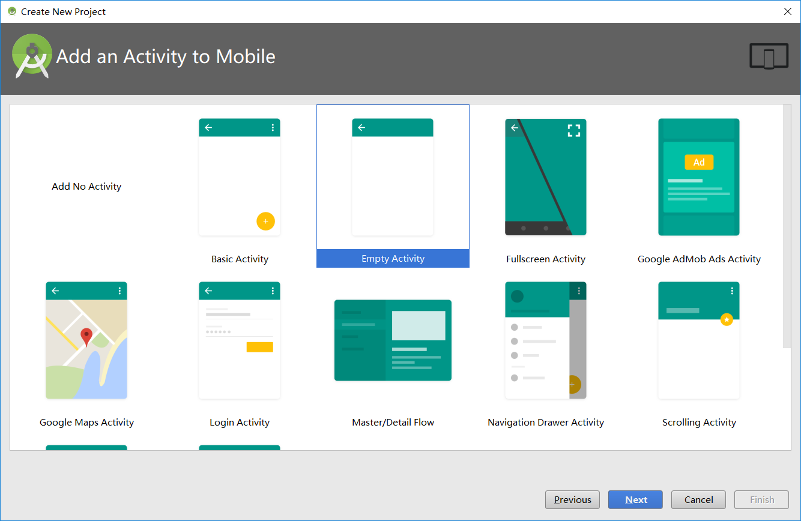
 
    
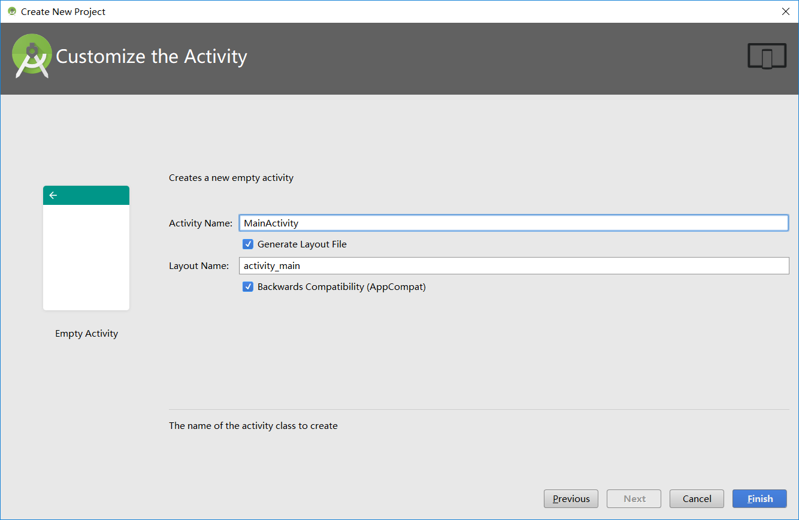
 

2. Unzip NOLO-SDK and copy all the files into the libs folder.
    
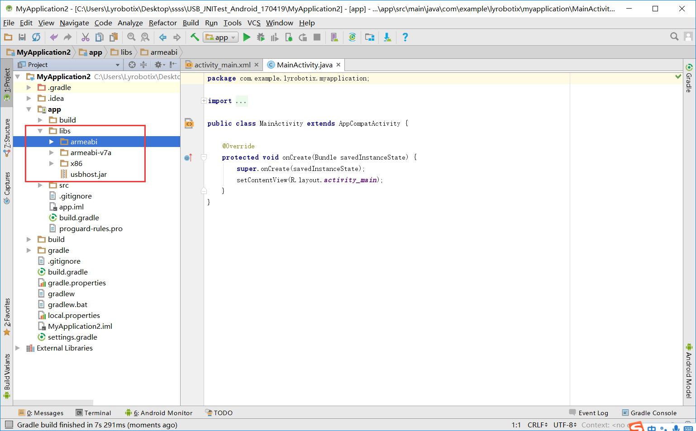
 

3. Add usbhost.jar as library.
    
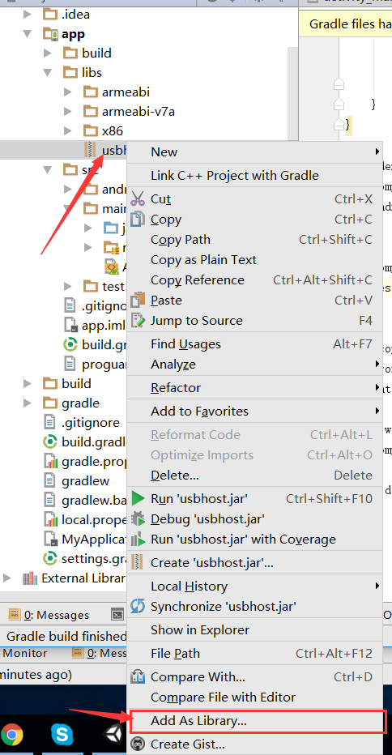
 
    
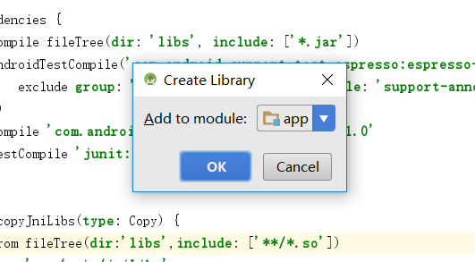
 

4. Add the following code into the AndroidMainifest.xml file
    
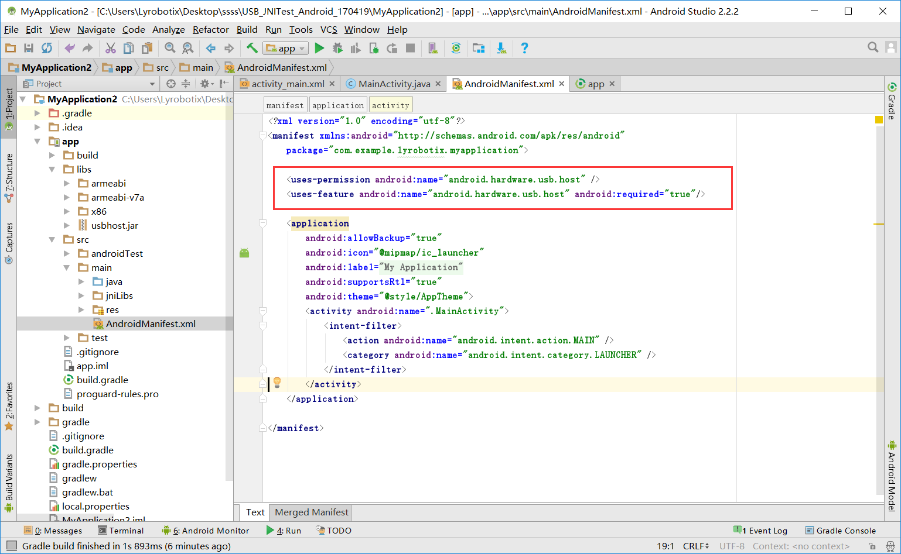

5. Add two buttons, and add the following code to enable 'click' events.
    
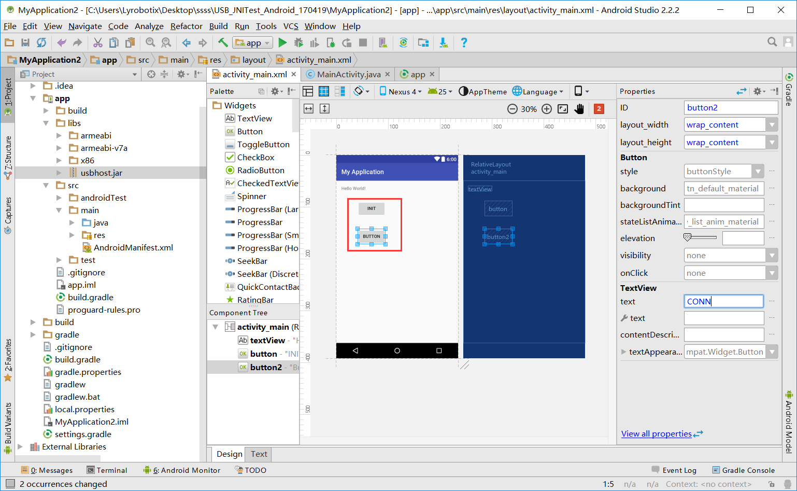
 
    
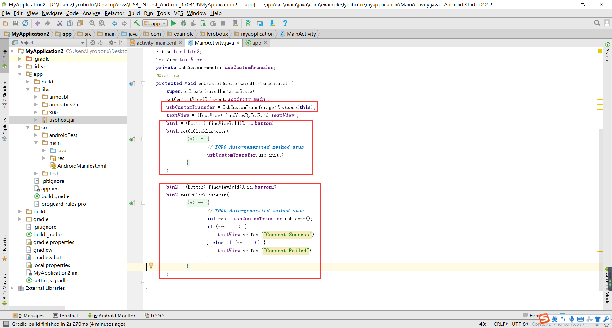
 

6. Build project.
    
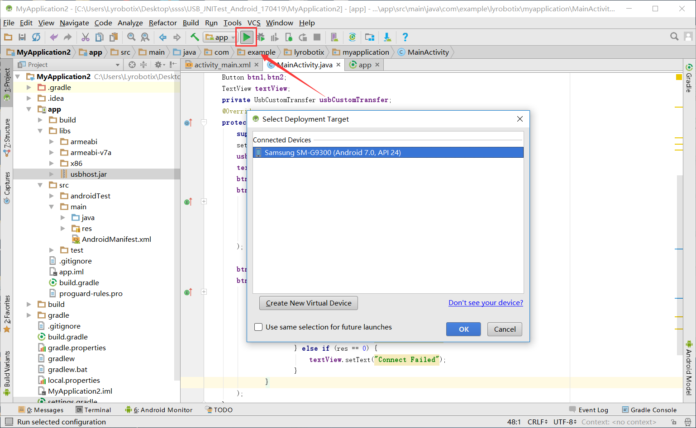
 