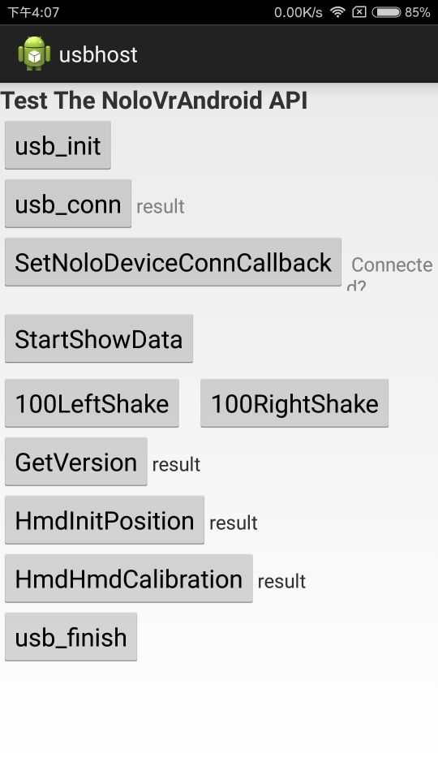
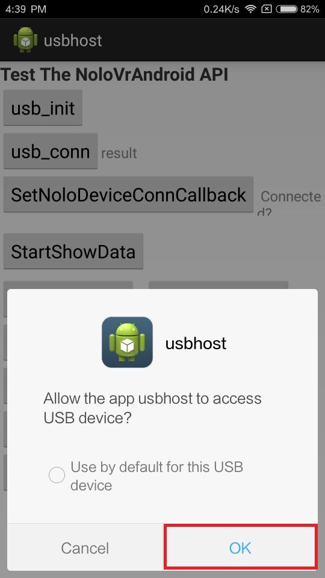
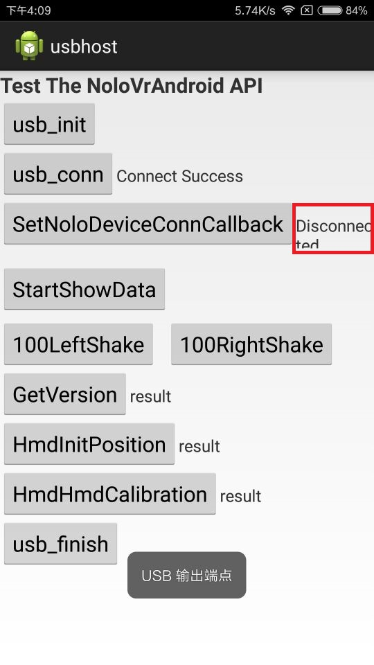
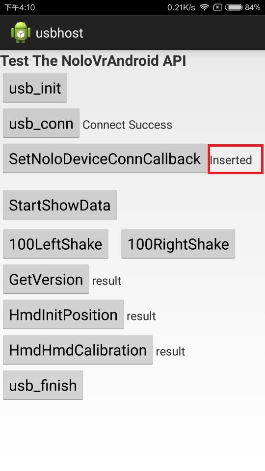
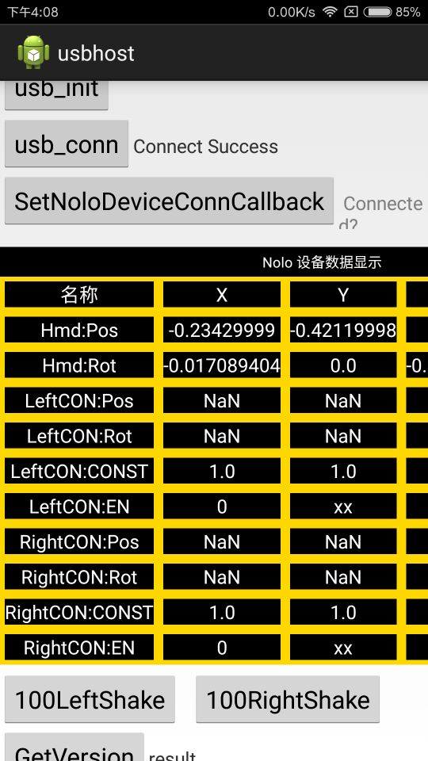

# Demo Description
My test phone is MI5.  

Install [Demo](./Android_SDK_Demo_170518.apk) and open it,you can see as:

 

First,Plug NOLO Headset in phone,Click "usb_init"  and allow the app to access USB device.

After that click "usb_conn" to get connect to NOLO.
  
Click "SetNoloDeviceConnCallback",when you plug NOLO Headset out.

when you plug NOLO Headset in again.

Click "StartShowData".

Click "100LeftShake" or "100RightShake" Control the Handle Shake.  

Click "GetVersion" is to get the NOLO Hardware version,value "2" means NOLO CV1.  

Click "HmdInitPosition" to get the "Hmd:Pos" when you press the button on the headset.  

Click "HmdHmdCalibration" has been abandoned  

Clcik "usb_finish" to end the connection